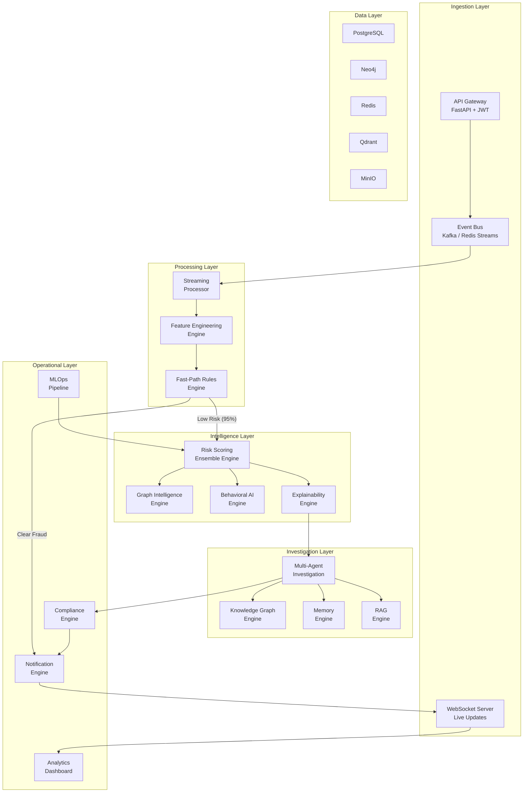

# AegisOS — The Autonomous AI Operating System for Financial Intelligence

> **Implementation Plan v1.0**

## Background & Research Summary

We analyzed three reference repositories and surveyed 20+ papers from arXiv (2024–2026) to inform this architecture:

| Repository | Focus | Key Takeaway | Key Weakness |
|---|---|---|---|
| `Tek-nr/AI-Based-Fraud-Detection` | Batch ML benchmarking | Multi-model comparison harness, cross-dataset schema standardization | No serving layer, no explainability, notebook-only |
| `skyritzz/YAROX` | Real-time stream processing | Dual-path (rules + ML) decision engine, velocity aggregators | In-memory state loss, hardcoded rules |
| `rmayank-24/AI-POWERED-FRAUD-DETECTION` | Monolithic web app | Analyst dashboard concepts, payload validation | Monolithic, synchronous, no audit trail |

**Research-informed innovations we will incorporate:**
- Dual-Path Graph Filtering (DPF-GFD, 2026) for heterophily-aware fraud ring detection
- SHAP-Guided Adaptive Ensemble (SGAE, 2026) for dynamic model weighting
- Multi-agent investigation frameworks (SAGE/AuditAgent, 2025–2026) for autonomous case investigation
- Tiered multi-latency pipeline architecture (Fast Path <20ms, Deep Path <1s)
- Prototype Knowledge Replay for drift-resilient continual learning
- Graph-RAG hybrid retrieval for knowledge graph + vector search

---

## User Review Required

> [!IMPORTANT]
> **Scope Management**: This is an enormous platform. The plan below covers the **full production architecture** but proposes a **phased build** approach. Phase 1 delivers a fully functional, demo-ready system. Phases 2–3 add enterprise features. Please confirm the phased approach.

> [!WARNING]
> **LLM API Keys**: The multi-agent investigation engine requires an LLM provider (OpenAI/Anthropic/local). The plan uses configurable providers with `.env` settings. You'll need API keys for full agent functionality.

> [!IMPORTANT]
> **Infrastructure Dependencies**: The full platform uses PostgreSQL, Neo4j, Redis, and Qdrant. For Phase 1, we'll use SQLite + in-memory graph + in-memory vector store to enable zero-dependency local development, with adapters for production databases.

## Open Questions

1. **LLM Provider**: Which LLM provider should agents default to? (OpenAI GPT-4o, Anthropic Claude, local Ollama, or configurable?)
2. **Dashboard Framework**: The spec says Next.js + TailwindCSS + shadcn/ui. Should I proceed with this stack, or would you prefer a simpler single-page React + Vite setup for faster iteration?
3. **Sample Data**: Should I generate realistic synthetic fraud datasets, or use the Kaggle Credit Card Fraud dataset as a demo baseline?
4. **Deployment Target**: Docker Compose only, or also include Kubernetes manifests in Phase 1?

---

## Proposed Architecture



---

## Proposed Changes

### Phase 1 — Core Platform (What We Build Now)

This phase delivers a fully functional, demo-ready fraud intelligence platform with all core services operational.

---

### 1. Project Foundation & Configuration

#### [NEW] Project Root Structure
```
aegisos/
├── apps/
│   ├── api/                    # FastAPI gateway
│   ├── dashboard/              # Next.js frontend
│   ├── workers/                # Celery async workers
│   └── docs/                   # Documentation site
├── services/
│   ├── feature_engine/         # Feature engineering
│   ├── graph_engine/           # Graph intelligence
│   ├── behavioral_ai/         # Behavioral analysis
│   ├── risk_engine/           # Risk scoring & ensemble
│   ├── explainability/        # XAI engine
│   ├── memory/                # Vector + KG memory
│   ├── agents/                # Multi-agent investigation
│   ├── compliance/            # Compliance engine
│   ├── notification/          # Alert & notification
│   └── streaming/             # Stream processing
├── models/                     # ML model definitions
│   ├── ensemble/              # Gradient boosting ensemble
│   ├── graph_models/          # GNN models
│   ├── autoencoders/          # Anomaly detection
│   ├── temporal/              # Temporal transformers
│   └── registry/              # Model registry interface
├── core/                       # Shared kernel
│   ├── config/                # Configuration management
│   ├── database/              # Database adapters
│   ├── schemas/               # Pydantic schemas
│   ├── security/              # Auth, JWT, RBAC
│   ├── events/                # Event bus abstraction
│   └── utils/                 # Shared utilities
├── datasets/                   # Synthetic data generators
├── infrastructure/
│   ├── docker/                # Docker configs
│   ├── k8s/                   # Kubernetes manifests
│   └── terraform/             # IaC templates
├── scripts/                    # Setup & utility scripts
├── notebooks/                  # Research notebooks
├── tests/                      # Test suites
│   ├── unit/
│   ├── integration/
│   └── e2e/
├── research/                   # Research notes & papers
├── .github/                    # CI/CD workflows
├── docker-compose.yml
├── pyproject.toml
├── Makefile
└── README.md
```

#### [NEW] [pyproject.toml](file:///c:/Users/devch/Desktop/AegisOS/pyproject.toml)
- Project metadata, dependencies, tool configuration
- Uses `uv` or `pip` with extras: `[api]`, `[ml]`, `[graph]`, `[agents]`, `[all]`

#### [NEW] [Makefile](file:///c:/Users/devch/Desktop/AegisOS/Makefile)
- `make install`, `make dev`, `make test`, `make docker-up`, `make lint`

#### [NEW] [docker-compose.yml](file:///c:/Users/devch/Desktop/AegisOS/docker-compose.yml)
- Services: api, dashboard, worker, postgres, neo4j, redis, qdrant, minio

---

### 2. Core Shared Kernel (`core/`)

#### [NEW] [core/config/settings.py](file:///c:/Users/devch/Desktop/AegisOS/core/config/settings.py)
- Pydantic `BaseSettings` for all configuration
- Environment-based config with `.env` support
- Sections: database, redis, kafka, llm, security, feature flags

#### [NEW] [core/schemas/](file:///c:/Users/devch/Desktop/AegisOS/core/schemas/)
- `transaction.py` — Transaction schema (supports credit card, UPI, wire, crypto)
- `entity.py` — User, Merchant, Device, Account entities
- `risk.py` — RiskScore, RiskVerdict, RiskExplanation
- `investigation.py` — Case, Evidence, Finding, Report
- `events.py` — Event envelope schema for event bus

#### [NEW] [core/database/](file:///c:/Users/devch/Desktop/AegisOS/core/database/)
- `adapters.py` — Abstract DB adapter protocol + SQLite/PostgreSQL implementations
- `models.py` — SQLAlchemy ORM models
- `migrations/` — Alembic migration infrastructure

#### [NEW] [core/security/](file:///c:/Users/devch/Desktop/AegisOS/core/security/)
- `auth.py` — JWT token creation/validation, OAuth2 password flow
- `rbac.py` — Role-Based Access Control (admin, analyst, viewer, api_user)
- `encryption.py` — Field-level encryption for PII data
- `audit.py` — Audit log middleware

#### [NEW] [core/events/](file:///c:/Users/devch/Desktop/AegisOS/core/events/)
- `bus.py` — Abstract EventBus protocol
- `memory_bus.py` — In-memory event bus (dev)
- `redis_bus.py` — Redis Streams event bus (production)
- `kafka_bus.py` — Kafka event bus (enterprise)

---

### 3. API Gateway (`apps/api/`)

#### [NEW] [apps/api/main.py](file:///c:/Users/devch/Desktop/AegisOS/apps/api/main.py)
- FastAPI app with versioned routes (`/api/v1/`)
- CORS, rate limiting, request ID middleware
- Lifespan events for startup/shutdown

#### [NEW] [apps/api/routes/](file:///c:/Users/devch/Desktop/AegisOS/apps/api/routes/)
- `transactions.py` — POST transaction scoring, batch scoring, transaction history
- `investigations.py` — CRUD for investigation cases
- `entities.py` — User/merchant/device entity lookup & graph
- `risk.py` — Risk score queries, threshold management
- `graph.py` — Graph queries, community detection, path analysis
- `auth.py` — Login, register, token refresh
- `admin.py` — Model management, system health, config
- `streaming.py` — WebSocket endpoints for live scoring

---

### 4. Feature Engineering Engine (`services/feature_engine/`)

#### [NEW] [services/feature_engine/engine.py](file:///c:/Users/devch/Desktop/AegisOS/services/feature_engine/engine.py)
- `FeatureEngineeringEngine` — Orchestrates feature extraction pipeline
- Supports both batch and streaming modes
- Pluggable feature extractors via registry pattern

#### [NEW] [services/feature_engine/extractors/](file:///c:/Users/devch/Desktop/AegisOS/services/feature_engine/extractors/)
- `transaction_features.py` — Amount stats, velocity, frequency, ratios
- `temporal_features.py` — Time-of-day, day-of-week, recency, periodicity
- `geo_features.py` — Distance, velocity, country risk, geo-anomaly
- `device_features.py` — Device fingerprint features, device age, device sharing
- `behavioral_features.py` — Spending pattern deviation, merchant category habits
- `graph_features.py` — Degree centrality, PageRank, community ID, neighbor risk
- `aggregate_features.py` — Rolling window aggregations (1m, 5m, 1h, 24h, 7d, 30d)

#### [NEW] [services/feature_engine/store.py](file:///c:/Users/devch/Desktop/AegisOS/services/feature_engine/store.py)
- Feature store abstraction with Redis-backed real-time store
- Historical feature retrieval for training

---

### 5. Risk Scoring Engine (`services/risk_engine/`)

#### [NEW] [services/risk_engine/engine.py](file:///c:/Users/devch/Desktop/AegisOS/services/risk_engine/engine.py)
- `RiskScoringEngine` — Tiered scoring pipeline:
  1. Fast-path rule evaluation (<5ms)
  2. Ensemble ML scoring (<20ms)
  3. Deep-path async analysis (graph + behavioral + agents)

#### [NEW] [services/risk_engine/rules/](file:///c:/Users/devch/Desktop/AegisOS/services/risk_engine/rules/)
- `rule_engine.py` — Declarative rule evaluation engine
- `rules.yaml` — Configurable fraud rules (velocity, blocklist, amount, geo)
- Rules support hot-reload without service restart

#### [NEW] [services/risk_engine/ensemble.py](file:///c:/Users/devch/Desktop/AegisOS/services/risk_engine/ensemble.py)
- `AdaptiveEnsemble` — SHAP-guided dynamic ensemble (from SGAE paper)
- Integrates XGBoost, LightGBM, CatBoost, IsolationForest
- Dynamic weight adjustment based on feature-attribution agreement
- Calibrated probability output

#### [NEW] [models/ensemble/](file:///c:/Users/devch/Desktop/AegisOS/models/ensemble/)
- `xgboost_model.py` — XGBoost fraud classifier
- `lightgbm_model.py` — LightGBM fraud classifier
- `catboost_model.py` — CatBoost fraud classifier
- `isolation_forest.py` — Isolation Forest anomaly detector
- `autoencoder.py` — Autoencoder anomaly detector (PyTorch)
- `base.py` — Abstract `FraudModel` protocol with `predict`, `explain`, `train`

---

### 6. Graph Intelligence Engine (`services/graph_engine/`)

#### [NEW] [services/graph_engine/engine.py](file:///c:/Users/devch/Desktop/AegisOS/services/graph_engine/engine.py)
- `GraphIntelligenceEngine` — Core graph operations
- Entity resolution, link analysis, fraud ring detection

#### [NEW] [services/graph_engine/schema.py](file:///c:/Users/devch/Desktop/AegisOS/services/graph_engine/schema.py)
- Node types: User, Device, Card, Account, Merchant, IP, Location, Transaction
- Edge types: paid_to, owns, connected_to, shares_device, shares_ip, same_location, same_email, same_phone, same_merchant, transferred_to

#### [NEW] [services/graph_engine/algorithms/](file:///c:/Users/devch/Desktop/AegisOS/services/graph_engine/algorithms/)
- `risk_propagation.py` — Iterative risk score propagation through graph
- `community_detection.py` — Louvain/Label propagation for fraud ring detection
- `path_analysis.py` — Shortest path & money flow tracing
- `centrality.py` — Degree, betweenness, PageRank centrality scoring
- `embeddings.py` — Node2Vec / GraphSAGE embeddings

#### [NEW] [services/graph_engine/store.py](file:///c:/Users/devch/Desktop/AegisOS/services/graph_engine/store.py)
- Abstract graph store protocol
- `NetworkXStore` for development (in-memory)
- `Neo4jStore` for production

#### [NEW] [models/graph_models/](file:///c:/Users/devch/Desktop/AegisOS/models/graph_models/)
- `graphsage.py` — GraphSAGE implementation (PyTorch Geometric)
- `gat.py` — Graph Attention Network
- `tgn.py` — Temporal Graph Network
- `hgnn.py` — Heterogeneous Graph Neural Network

---

### 7. Behavioral AI Engine (`services/behavioral_ai/`)

#### [NEW] [services/behavioral_ai/engine.py](file:///c:/Users/devch/Desktop/AegisOS/services/behavioral_ai/engine.py)
- `BehavioralIntelligenceEngine` — User behavior profiling & anomaly detection
- Maintains per-user behavioral profiles

#### [NEW] [services/behavioral_ai/profiles.py](file:///c:/Users/devch/Desktop/AegisOS/services/behavioral_ai/profiles.py)
- `BehaviorProfile` — Tracks spending habits, device habits, merchant habits, geo habits, temporal habits
- Incremental profile updates with exponential decay

#### [NEW] [services/behavioral_ai/anomaly.py](file:///c:/Users/devch/Desktop/AegisOS/services/behavioral_ai/anomaly.py)
- Statistical anomaly scoring per behavioral dimension
- Mahalanobis distance for multivariate deviation
- Z-score with adaptive thresholds

#### [NEW] [models/temporal/](file:///c:/Users/devch/Desktop/AegisOS/models/temporal/)
- `temporal_transformer.py` — Transformer encoder for transaction sequences
- `sequence_encoder.py` — LSTM/GRU sequence encoder

---

### 8. Explainability Engine (`services/explainability/`)

#### [NEW] [services/explainability/engine.py](file:///c:/Users/devch/Desktop/AegisOS/services/explainability/engine.py)
- `ExplainabilityEngine` — Unified explanation generation
- Produces risk score, confidence, top features, SHAP values, graph evidence, behavioral deviations, counterfactual reasoning, natural language explanation, similar cases

#### [NEW] [services/explainability/shap_explainer.py](file:///c:/Users/devch/Desktop/AegisOS/services/explainability/shap_explainer.py)
- TreeSHAP for ensemble models
- Feature importance ranking & waterfall charts

#### [NEW] [services/explainability/counterfactual.py](file:///c:/Users/devch/Desktop/AegisOS/services/explainability/counterfactual.py)
- Counterfactual explanation generation
- "What minimal changes would make this transaction safe?"

#### [NEW] [services/explainability/narrator.py](file:///c:/Users/devch/Desktop/AegisOS/services/explainability/narrator.py)
- LLM-powered natural language explanation generator
- Templates for common fraud patterns + LLM for complex cases

---

### 9. Multi-Agent Investigation Engine (`services/agents/`)

#### [NEW] [services/agents/orchestrator.py](file:///c:/Users/devch/Desktop/AegisOS/services/agents/orchestrator.py)
- `InvestigationOrchestrator` — Coordinates investigation workflow
- State machine: ALERT → TRIAGE → INVESTIGATE → EVIDENCE → DECIDE → REPORT
- Supervisor agent pattern for quality control

#### [NEW] [services/agents/agents/](file:///c:/Users/devch/Desktop/AegisOS/services/agents/agents/)
- `transaction_investigator.py` — Analyzes transaction patterns & anomalies
- `graph_detective.py` — Explores graph connections & fraud rings
- `behavior_analyst.py` — Evaluates behavioral deviations
- `risk_assessor.py` — Synthesizes risk assessment
- `compliance_officer.py` — Checks regulatory requirements
- `evidence_collector.py` — Aggregates evidence from all sources
- `report_generator.py` — Generates investigation reports & SARs
- `decision_agent.py` — Makes final fraud/legitimate decision
- `supervisor.py` — Reviews and validates agent findings

#### [NEW] [services/agents/memory.py](file:///c:/Users/devch/Desktop/AegisOS/services/agents/memory.py)
- Agent working memory (short-term)
- Investigation context passing between agents

---

### 10. Memory Engine (`services/memory/`)

#### [NEW] [services/memory/engine.py](file:///c:/Users/devch/Desktop/AegisOS/services/memory/engine.py)
- `MemoryEngine` — Unified memory interface

#### [NEW] [services/memory/vector_store.py](file:///c:/Users/devch/Desktop/AegisOS/services/memory/vector_store.py)
- Vector memory for semantic search over past cases
- In-memory FAISS for development, Qdrant for production

#### [NEW] [services/memory/knowledge_graph.py](file:///c:/Users/devch/Desktop/AegisOS/services/memory/knowledge_graph.py)
- Fraud pattern knowledge graph
- Known fraud typologies, modus operandi, red flags

#### [NEW] [services/memory/case_store.py](file:///c:/Users/devch/Desktop/AegisOS/services/memory/case_store.py)
- Investigation case history
- Decision history with outcomes

---

### 11. Streaming Engine (`services/streaming/`)

#### [NEW] [services/streaming/engine.py](file:///c:/Users/devch/Desktop/AegisOS/services/streaming/engine.py)
- `StreamProcessor` — Real-time transaction processing pipeline
- Async processing with configurable concurrency
- Sub-second inference target

#### [NEW] [services/streaming/consumers.py](file:///c:/Users/devch/Desktop/AegisOS/services/streaming/consumers.py)
- Kafka consumer / Redis Streams consumer abstraction
- Batch + single message consumption modes

#### [NEW] [services/streaming/producers.py](file:///c:/Users/devch/Desktop/AegisOS/services/streaming/producers.py)
- Event producers for downstream services

---

### 12. Compliance Engine (`services/compliance/`)

#### [NEW] [services/compliance/engine.py](file:///c:/Users/devch/Desktop/AegisOS/services/compliance/engine.py)
- AML screening, sanctions checking, PEP lists
- SAR auto-generation
- Audit trail maintenance
- Regulatory report templates

---

### 13. Notification Engine (`services/notification/`)

#### [NEW] [services/notification/engine.py](file:///c:/Users/devch/Desktop/AegisOS/services/notification/engine.py)
- Multi-channel alerts: WebSocket, email, Slack, webhook
- Alert prioritization and deduplication
- Escalation policies

---

### 14. Data Generation & Datasets

#### [NEW] [datasets/generator.py](file:///c:/Users/devch/Desktop/AegisOS/datasets/generator.py)
- Realistic synthetic transaction data generator
- Supports all fraud types (credit card, UPI, wire, AML, synthetic identity, etc.)
- Generates entity graphs (users, merchants, devices, accounts)
- Configurable fraud injection with realistic patterns

#### [NEW] [datasets/scenarios/](file:///c:/Users/devch/Desktop/AegisOS/datasets/scenarios/)
- Pre-built fraud scenarios: card_fraud, money_mule, account_takeover, synthetic_identity, merchant_fraud

---

### 15. Frontend Dashboard (`apps/dashboard/`)

#### [NEW] Next.js + TypeScript + TailwindCSS + shadcn/ui
- **Fraud Dashboard** — Real-time transaction monitoring, risk heatmaps, KPI cards
- **Graph Explorer** — Interactive graph visualization (React Flow / D3.js)
- **Investigation Workspace** — Case management, timeline, evidence viewer
- **Live Streaming Panel** — WebSocket-powered live transaction feed
- **Model Monitoring** — Model performance metrics, drift indicators

---

### 16. Infrastructure & DevOps

#### [NEW] [docker-compose.yml](file:///c:/Users/devch/Desktop/AegisOS/docker-compose.yml)
- Full stack: API, dashboard, workers, PostgreSQL, Neo4j, Redis, Qdrant, MinIO

#### [NEW] [.github/workflows/](file:///c:/Users/devch/Desktop/AegisOS/.github/workflows/)
- `ci.yml` — Lint, type-check, test on PR
- `cd.yml` — Build & push Docker images on merge

---

### 17. Documentation

#### [NEW] [README.md](file:///c:/Users/devch/Desktop/AegisOS/README.md)
- Professional README with architecture diagram, quickstart, features, screenshots
- Badges, contribution guide, license

#### [NEW] [research/](file:///c:/Users/devch/Desktop/AegisOS/research/)
- `architecture_decisions.md` — ADRs for key design decisions
- `paper_references.md` — Research papers that informed the design

---

## Phase 2 — Advanced Intelligence (Future)

- Full GNN training pipeline (GraphSAGE, GAT, TGN, HGNN)
- Active learning & human-in-the-loop feedback
- Drift detection & automatic retraining
- MLflow integration with experiment tracking
- Full Kubernetes deployment manifests
- Deepfake KYC detection (image/video/audio analysis)
- Blockchain transaction analysis

## Phase 3 — Enterprise Features (Future)

- Multi-tenant architecture
- Full PCI-DSS compliance
- SOC2 audit readiness
- Advanced RAG with regulatory document search
- Automated red-teaming engine
- Production Kafka + Flink integration
- Custom model training UI

---

## Verification Plan

### Automated Tests
```bash
# Unit tests for all services
make test-unit

# Integration tests with test database
make test-integration

# API endpoint tests
make test-api

# Linting & type checking
make lint
```

### Manual Verification
- Start the full stack with `docker-compose up`
- Submit sample transactions via API and verify risk scoring
- Open dashboard and verify real-time updates
- Trigger investigation workflow and verify agent chain
- Verify graph explorer renders entity connections
- Check explainability output includes all required components
